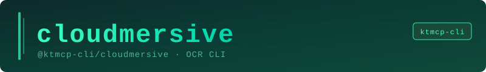

# Cloudmersive OCR CLI



> "Six months ago, everyone was talking about MCPs. And I was like, screw MCPs. Every MCP would be better as a CLI."
> — Peter Steinberger, Founder of OpenClaw

Extract text from images, PDFs, receipts, business cards, and forms using the [Cloudmersive OCR API](https://cloudmersive.com/ocr-api) — right from your terminal.

**This is an unofficial CLI. It is not affiliated with or endorsed by Cloudmersive.**

---

## Installation

```bash
npm install -g @ktmcp-cli/cloudmersive
```

Or use without installing:

```bash
npx @ktmcp-cli/cloudmersive --help
```

---

## Setup

Get a free API key at [cloudmersive.com](https://cloudmersive.com) and configure the CLI:

```bash
cloudmersive config set --api-key YOUR_API_KEY
```

---

## Commands

### Configuration

```bash
cloudmersive config set --api-key YOUR_KEY   # Save API key
cloudmersive config show                      # Show current config
cloudmersive config clear                     # Remove all config
```

### Image OCR

Extract text from scanned documents, screenshots, or any image:

```bash
cloudmersive image to-text document.png
cloudmersive image to-text scan.jpg --json

# Extract text with line-level position data
cloudmersive image to-lines document.png
cloudmersive image to-lines document.png --json
```

### PDF OCR

Extract text from PDF files (including scanned PDFs):

```bash
cloudmersive pdf to-text report.pdf
cloudmersive pdf to-text invoice.pdf --json
```

### Photo Recognition

Optimized for natural photos (not scanned documents):

```bash
# General photo text extraction
cloudmersive photo to-text photo.jpg

# Extract structured receipt data
cloudmersive photo recognize-receipt receipt.jpg
cloudmersive photo recognize-receipt receipt.jpg --json

# Extract contact info from a business card
cloudmersive photo recognize-business-card card.jpg

# Extract form fields from a form image
cloudmersive photo recognize-form form.png
```

### Image Preprocessing

Improve OCR accuracy before extraction:

```bash
# Convert to black-and-white (binarize) for better accuracy
cloudmersive preprocess binarize scan.jpg

# Detect page rotation angle
cloudmersive preprocess page-angle skewed.jpg
cloudmersive preprocess page-angle skewed.jpg --json
```

---

## Output Flags

All commands support `--json` to get the raw API response as JSON:

```bash
cloudmersive image to-text doc.png --json | jq '.TextResult'
```

---

## Supported File Types

- **Images**: PNG, JPG, JPEG, BMP, TIFF, GIF
- **PDFs**: Standard and scanned PDFs

---

## API Coverage

| Command | Cloudmersive Endpoint |
|---|---|
| `image to-text` | `POST /ocr/image/toText` |
| `image to-lines` | `POST /ocr/image/to/lines-with-location` |
| `pdf to-text` | `POST /ocr/pdf/toText` |
| `photo to-text` | `POST /ocr/photo/toText` |
| `photo recognize-receipt` | `POST /ocr/photo/recognize/receipt` |
| `photo recognize-business-card` | `POST /ocr/photo/recognize/business-card` |
| `photo recognize-form` | `POST /ocr/photo/recognize/form` |
| `preprocess binarize` | `POST /ocr/preprocessing/image/binarize` |
| `preprocess page-angle` | `POST /ocr/preprocessing/image/get-page-angle` |

---

## Requirements

- Node.js >= 18.0.0
- A Cloudmersive API key (free tier available)

---

## License

MIT — Copyright 2024 KTMCP

---

## Links

- [Cloudmersive OCR API Docs](https://cloudmersive.com/ocr-api)
- [Report Issues](https://github.com/ktmcp-cli/cloudmersive/issues)
- [KTMCP CLIs](https://killthemcp.com)


---

## Support KTMCP

If you find this CLI useful, we'd greatly appreciate your support! Share your experience on:
- Reddit
- Twitter/X
- Hacker News

**Incentive:** Users who can demonstrate that their support/advocacy helped advance KTMCP will have their feature requests and issues prioritized.

Just be mindful - these are real accounts and real communities. Authentic mentions and genuine recommendations go a long way!

## Support This Project

If you find this CLI useful, we'd appreciate support across Reddit, Twitter, Hacker News, or Moltbook. Please be mindful - these are real community accounts. Contributors who can demonstrate their support helped advance KTMCP will have their PRs and feature requests prioritized.
